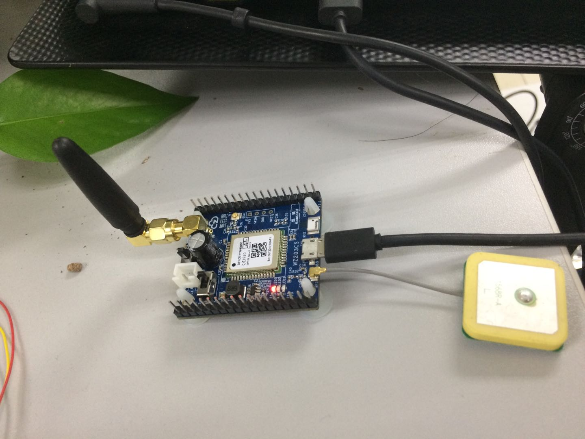
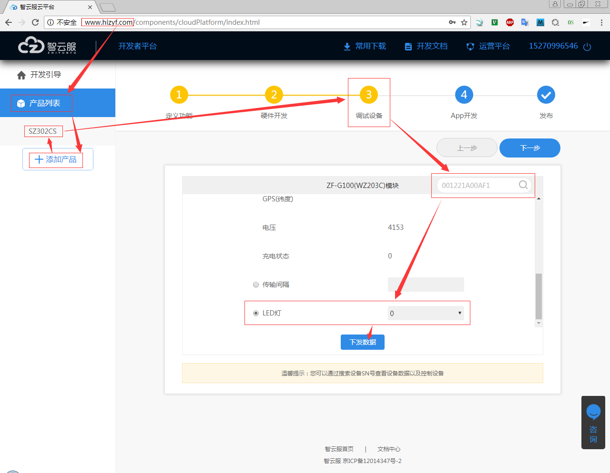
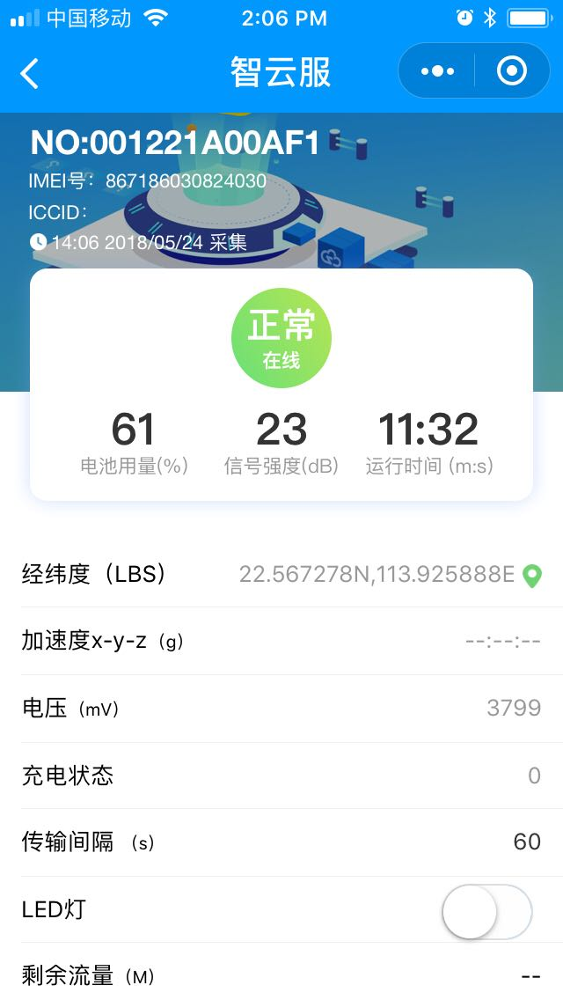

# Just Run Test

* 从淘宝商那里获取的资料是已经过时的资料；
* 在QQ交流群里获取的资料才是最新的资料；
* 老的资料有问题，安新的资料来操作才能正常工作；
* 设备是MQTT通信的；

## 参考文档

* [《WZ203CS-V3.0 开发板 support 文档.pdf》](./refers/WZ203CS-V3.0_dev_board_support_doc.pdf)

## 开发板开箱测试

### 设备连接

* 连接GSM天线；
* 连接定位系统天线；
* 连接USB线，115200波特率，有一些调试信息会输出，设置SN也是通过这个虚拟串口进行设置的；

### 服务器端LED调试

### 微信小程序调试

