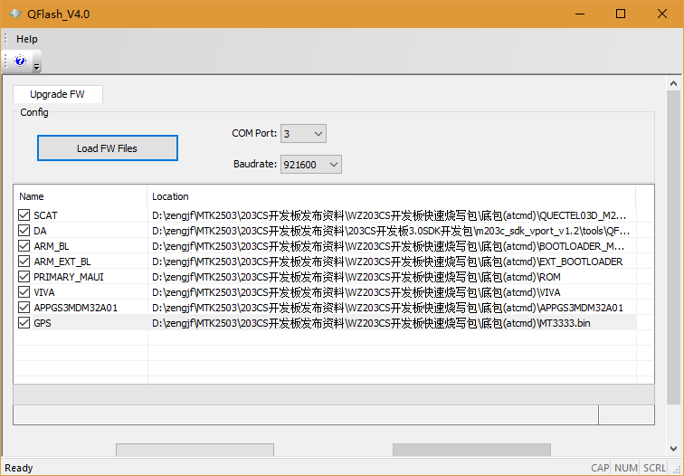
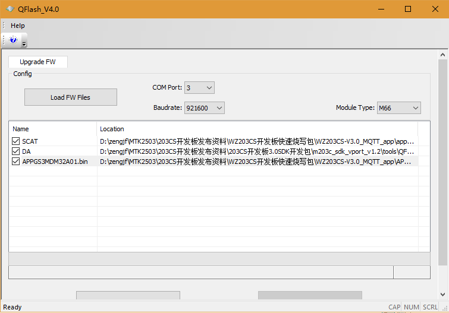
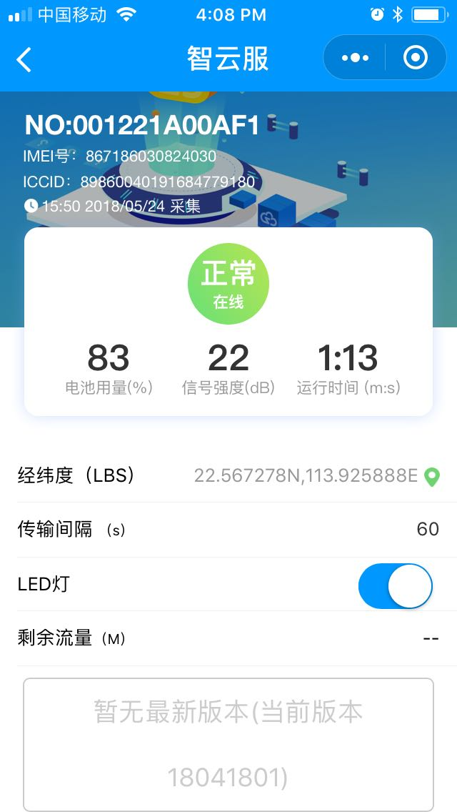

# Download Prebuild FW

# Download Tool

SDK Path: 203CS开发板3.0SDK开发包/m203c_sdk_vport_v1.2/tools/QFlash_V4.0/QFlash_V4.0.exe

## Prebuild FW

* WZ203CS开发板快速烧写包/WZ203CS-V3.0_MQTT_app  
  
* WZ203CS开发板快速烧写包/底包(atcmd)  
  

开发板断电，点击Start按钮，然后开发板上电，会开始烧录FW。

## 设置SN

* `$$setsn 001221A00AF1`: 普通设置方法
* `^^setsn 001221A00AF1`: 强制设置方法

## Data Show

