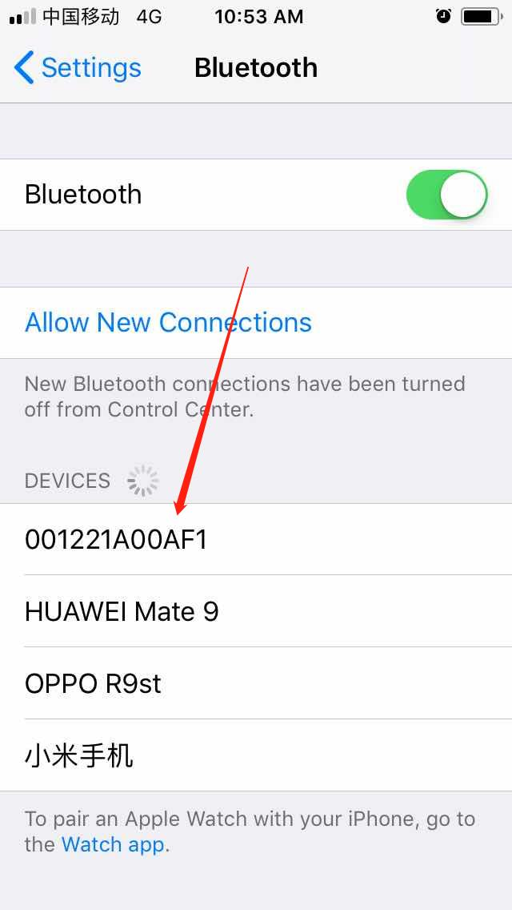

# WZ203CS-V3.0_MQTT_app

## Wechat 测试程序

* 直接烧录编译好的程序：`WZ203CS开发板快速烧写包\WZ203CS-V3.0_MQTT_app.rar`
* 源代码目录：`203CS开发板3.0SDK开发包\m203c_sdk_vport_v1.2\cloud\zyf_mqtt_ble_app`
* 源代码配置参考文件：`203CS开发板3.0SDK开发包\m203c_sdk_vport_v1.2\cloud\zyf_mqtt_ble_app\zyf_custom\main.c`
* Makefile配置(`203CS开发板3.0SDK开发包\m203c_sdk_vport_v1.2\make\gcc\gcc_makefile`)：  
  ```
  C_PREDEF=-D __ZFY_MQTT_APP__
  CLOUD_SOLUTION=ZYF_MQTT_SOLUTION
  ```

## 设置SN

* 普通设置：`$$setsn 001221A00AF1`
* 强制设置：`^^setsn 001221A00AF1`

**注意：** SN末尾不要有换行符，否者发送数据会失败导致连接中断问题。

## 程序运行输出信息

```
ZFY_BLE_GSM_GPS_V3.0.0
SN:001221A00AF1
Snuser:1
Interval:100
HandInter:60
updateinfo:0
+DataTime: 2004-01-01 16:00:00
BT device power on.
BT power  cur_pwrstate=1.
BT device name set successful.
BT callback function register successful.
RIL_BT_Gatsd failed.
Get BT device power status failed.
BT device already power on.
BT power  cur_pwrstate=1.
BT device name set successful.
BT callback function register successful.
RIL_BT_Gatsl =0
topic_for_sub=/c3ba888d8e2e/001221a00af1/ins
topic_for_pub=/c3ba888d8e2e/001221a00af1/data
topic_for_reg=/zyf/device/register
topic_for_upb=/c3ba888d8e2e/001221a00af1/upb
topic_for_red=/zyf/device/result
user_puser_info.port=1883
user_puser_info.host_name=www.hizyf.com
user_puser_info.client_id=001221A00AF1
user_puser_info.user_name=admin
user_puser_info.password=zyfadmin
[info]MQTT init success!
SIM card status is normal!
Network State:creg=2,cgreg=2
Network State:creg=2,cgreg=2
Network State:creg=2,cgreg=2
Network State:creg=2,cgreg=2
Network State:creg=2,cgreg=2
Network State:creg=2,cgreg=2
Network State:creg=2,cgreg=2
Network State:creg=2,cgreg=2
Network State:creg=2,cgreg=2
Network State:creg=2,cgreg=2
Network State:creg=2,cgreg=2
Network State:creg=2,cgreg=2
Network State:creg=2,cgreg=2
Network State:creg=2,cgreg=2
Network State:creg=2,cgreg=2
Network State:creg=2,cgreg=2
Network State:creg=2,cgreg=2
Network State:creg=2,cgreg=2
Network State:creg=2,cgreg=2
Network State:creg=2,cgreg=2
Network State:creg=2,cgreg=2
Network State:creg=2,cgreg=2
Network State:creg=2,cgreg=2
Network State:creg=2,cgreg=2
Network State:creg=1,cgreg=2
Network State:creg=1,cgreg=2
Network State:creg=1,cgreg=2
Network State:creg=1,cgreg=2
Network State:creg=1,cgreg=2
Network State:creg=1,cgreg=2
Network State:creg=1,cgreg=2
Network State:creg=1,cgreg=2
Network State:creg=1,cgreg=2
Network State:creg=1,cgreg=2
Network State:creg=1,cgreg=2
Network State:creg=1,cgreg=1
[info]mqtt connect success!
MQTT construct OK.
[info]mqtt subscribe success,topic = /c3ba888d8e2e/001221a00af1/ins!
[info]mqtt subscribe success,topic = /c3ba888d8e2e/001221a00af1/upb!
MQTT connect OK.
{
	"sn":	"001221A00AF1",
	"imei":	"\r\n867186030824030",
	"iccid":	"89860040191684779180",
	"imsi":	"\r\n460001961915267180",
	"pk":	"c3ba888d8e2e",
	"mode":	"0",
	"version":	"18041801"
}
MQTT connect OK.
subscribe success, packet-id=1
[info]SUBACK
publish success, packet-id=3
[info]PUBACK
subscribe success, packet-id=2
[info]SUBACK
topic=/c3ba888d8e2e/001221a00af1/upb{"insType":"time","insRunId":"51480","insValue":"$time 2018-05-28 10:47:07"}
payload_len=76
payload={"insType":"time","insRunId":"51480","insValue":"$time 2018-05-28 10:47:07"}
value[0]=time
value[1]=51480
keyvalue=$time 2018-05-28 10:47:07
[info]PUBLISH
<-- The PDP context id available is: 0 (can be 0 or 1)-->
<-- Set PDP context id to 0 -->
<-- Set APN -->
<--Ql_Getlocation-->

<-- Module location: latitude=22.567278, longitude=113.925888 -->
{
	"1E8D":	"3968",
	"1E9D":	"83",
	"023A":	"26",
	"2557":	"3",
	"1792":	"22.567278",
	"087B":	"113.925888"
}
USER_MQTT_CLINT_OK
MqttPubUserSensorData
publish success, packet-id=4
[info]PUBACK
Read -1 information failed.
Read -1 information failed.
0
0
0
0
0
0
0
0
0
0
0
0
0
0
0
0
topic=/c3ba888d8e2e/001221a00af1/ins{"insType":"66AA","insRunId":"51482","insValue":"1"}me 2018-05-28 10:47:07"}
payload_len=52
payload={"insType":"66AA","insRunId":"51482","insValue":"1"}me 2018-05-28 10:47:07"}
value[0]=66AA
value[1]=51482
value[2]=1
LED2_H
[info]PUBLISH
0
0
0
0
0
0
topic=/c3ba888d8e2e/001221a00af1/ins{"insType":"66AA","insRunId":"51485","insValue":"0"}me 2018-05-28 10:47:07"}
payload_len=52
payload={"insType":"66AA","insRunId":"51485","insValue":"0"}me 2018-05-28 10:47:07"}
value[0]=66AA
value[1]=51485
value[2]=0
LED2_L
[info]PUBLISH
0
0
0
0
0
0
0
0
0
0
```

## 蓝牙接口


