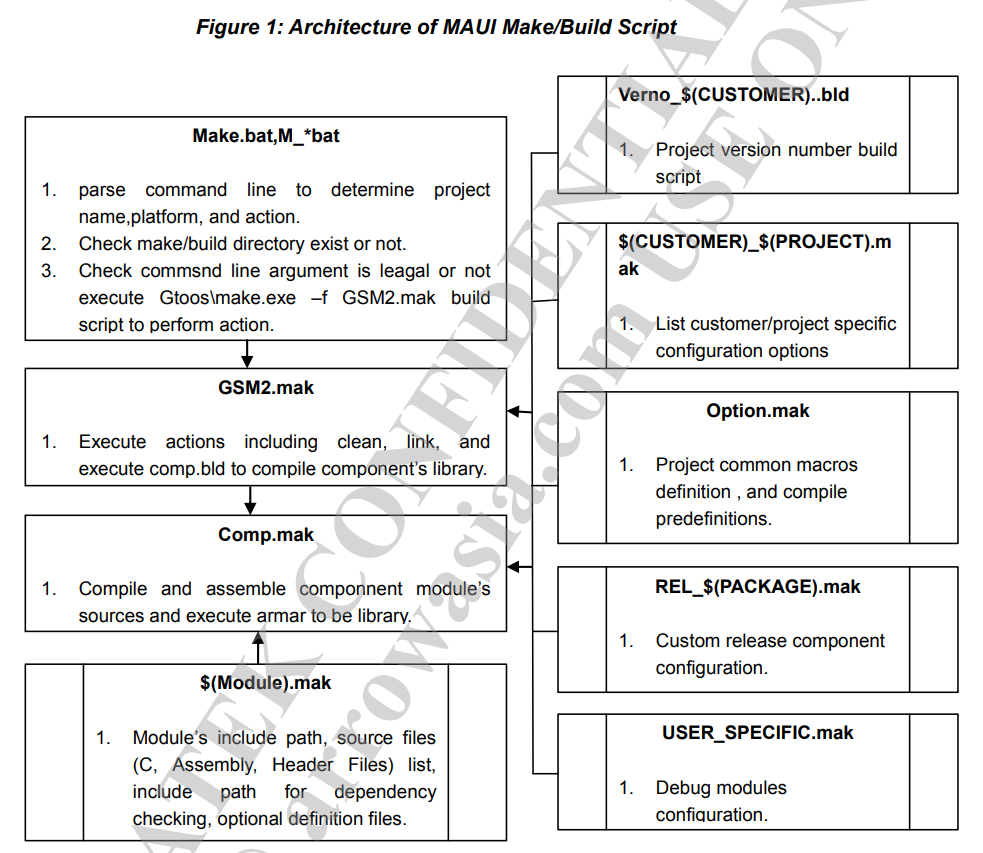

# Architecture of MAUI

## Arch of MAUI Script



## Add a Source Module

* grep `RELEASE_PACKAGE` key word;
  ```
  $ grep "RELEASE_PACKAGE" * -r | grep include
  ULTRA2503A_11C_GPRS.mak:include make\$(strip $(RELEASE_PACKAGE)).mak
  ULTRA2503A_11C_GPRS.mak(KAL_TRACE_OUTPUT=FULL):include make\$(strip $(RELEASE_PACKAGE)).mak
  ULTRA2503A_11C_GPRS.mak(KAL_TRACE_OUTPUT=NONE):include make\$(strip $(RELEASE_PACKAGE)).mak
  ```
* Add `zengjf` Module;
  ```
  ...[省略]
  # *************************************************************************
  # Project specified preprocessor definitions
  # *************************************************************************
  CUSTOM_OPTION     +=  __MSDC_NO_WRITE_PROTECT__
  CUSTOM_OPTION     +=  __BT_SHRINK_SIZE__ __MMS_MEMORY_CARD_STORAGE_SUPPORT__
  CUSTOM_OPTION     +=  __TST_USE_MINI_LOG_BUF__
  CUSTOM_OPTION     +=  __MRE_CUST_MEM_SIZE__=64
  CUSTOM_OPTION     +=  __DISABLE_SANDBOX_LIB__
  CUSTOM_OPTION     +=  __AUDIO_ULTRA_SLIM__
  CUSTOM_OPTION     +=  __CUSTOM_MRE_MAX_SIZE__=0
  CUSTOM_OPTION     +=  __GFX_SLIM_COLOR_FORMAT__ __GFX_SLIM_THUMB_SWITCH__
  CUSTOM_OPTION     +=  __TENCENTMCAREV31_ONLY_QQ2010__
  CUSTOM_OPTION     +=  __AT_FOR_SPEECH_TUNING_TOOL__
  CUSTOM_OPTION     +=  __MT6261_PRODUCTION_IMPROVE__
  REMOVE_CUSTOM_OPTION += __IP_NUMBER__
  
  # custom module setting
  # please add before the last line of this file:
  # include make\$(strip $(RELEASE_PACKAGE)).mak
  ifeq ($(strip $(CUSTOM_RELEASE)), TRUE)
    COMPLIST += zengjf
    CUS_REL_SRC_COMP += zengjf
    # CUS_REL_PAR_SRC_COMP += zengjf
  endif
  
  # *************************************************************************
  # Custom Release Component Configuration
  # *************************************************************************
  include make\$(strip $(RELEASE_PACKAGE)).mak
  ...[省略]
  ```
* Add `zengjf` folder to `make\zengjf`, and add `zengjf.mak` makefile;
