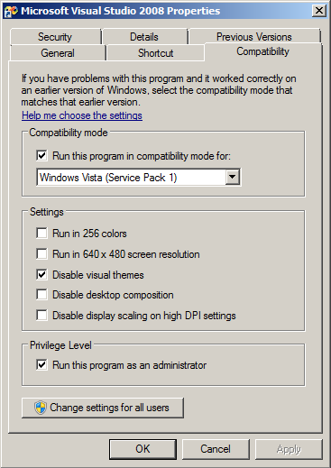
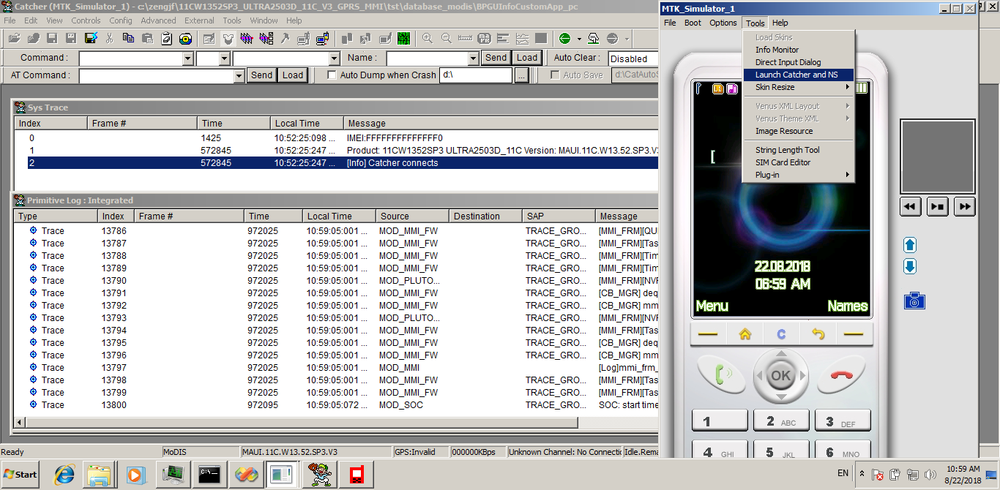

# Simulation VS2008 Env

* en_windows_7_ultimate_x64_dvd.iso
* VS2008TeamSuiteENU90DayTrialX1429235.iso
* Catcher_v3.1532.00(Official)

## 参考文档

* [vs2008 下载 SP1 英文版本](http://blog.sina.com.cn/s/blog_50a0aa5e0102vnu5.html)
* [Windows 7 VS2008升级补丁 代码](http://blog.sina.com.cn/s/blog_50a0aa5e01016f5t.html)
* [Win7下Platform Builder6.0出现”fatal error C1033: cannot open program database ” 解决方案](https://www.xuebuyuan.com/558644.html)

## VS2008兼容性设置

## 仿真界面

