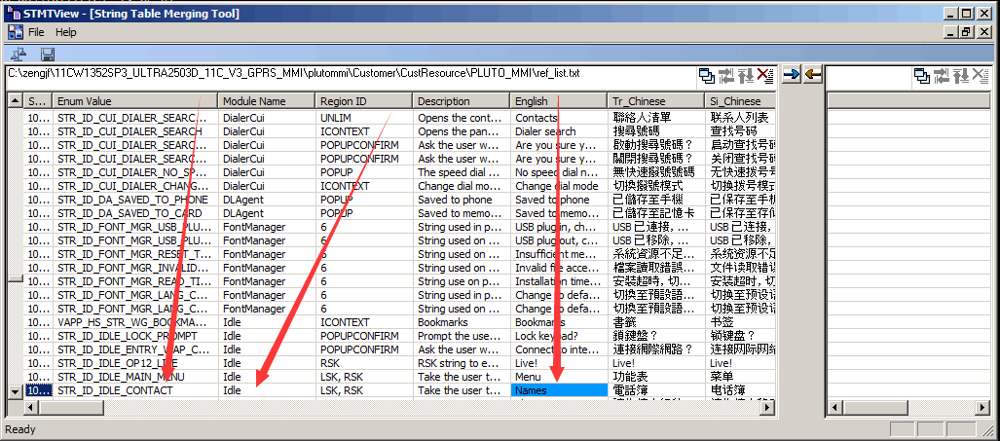
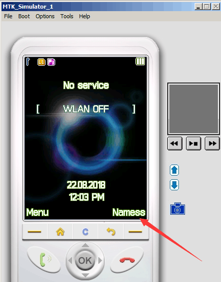

# Home Page Names Modify

## 参考文档

* [请教大家一个修改MTK ref_list.txt的问题](http://www.52rd.com/bbs/Archive_Thread.asp?SID=180141&TID=4&WebShieldDRSessionVerify=vXVRWNPUL4rK6UD0HYEw)

## Code Hacking

* `plutommi/Customer/CustResource/PLUTO_MMI/ref_list.txt`
  ```
  STR_ID_IDLE_CONTACT	Idle	LSK, RSK	Take the user to the phonebook	Names	電話簿	电话簿	ชื่อ	Nombres	Noms 	Namen	Имена	Nomi	الأسماء	Nomes	Adlar	Tên	Nama	Nama	नाम				Nevek				Namen			Nume			שמות	Имена	नावे	نامها	نام	பெயர்கள்	নাম		పేర్లు							Voorname																Nombres		Nomes				Names									အမည်များ			이름	အမည္မ်ား	
  ```
* `plutommi/Customer/STMTView.exe`  
  
* `make ULTRA2503D_11C gprs update`
* 查看修改效果：  
  
* `grep STR_ID_IDLE_CONTACT * -R`: 确认Idle模块
  ```Shell
  Binary file MoDIS_VC9/mmiresource/Debug/vc90.pdb matches
  Binary file MoDIS_VC9/mmi_app/Debug/idleclassic.obj matches
  Binary file MoDIS_VC9/mmi_app/Debug/idlecommon.obj matches
  Binary file MoDIS_VC9/mmi_app/Debug/mmi_app.lib matches
  Binary file MoDIS_VC9/mmi_app/Debug/vc90.pdb matches
  Binary file MoDIS_VC9/MoDIS/Debug/MoDIS.pdb matches
  MoDIS_VC9/MoDIS/MSLT_INFO/mmi_mslt_string.txt:STR_ID_IDLE_CONTACT=27888
  grep: MoDIS_VC9/MoDIS.ncb: Device or resource busy
  plutommi/Customer/CustomerInc/mmi_rp_app_idle_def.h:    STR_ID_IDLE_CONTACT,
  Binary file plutommi/Customer/ResGenerator/debug/obj/mtk_resgenerator/res_IdleScreen.o matches
  Binary file plutommi/Customer/ResGenerator/debug/obj/mtk_resgenerator/res_PhoneBook.o matches
  Binary file plutommi/Customer/ResGenerator/debug/obj/mtk_resgenerator/res_Setting.o matches
  Binary file plutommi/Customer/ResGenerator/debug/obj/mtk_resgenerator_xml/mmi_rp_app_callset.o matches
  Binary file plutommi/Customer/ResGenerator/debug/obj/mtk_resgenerator_xml/mmi_rp_app_mainmenu.o matches
  Binary file plutommi/Customer/ResGenerator/debug/obj/mtk_resgenerator_xml/mmi_rp_app_soundrecorder.o matches
  plutommi/Customer/ResGenerator/debug/res/Idle.i:    <STRING id="STR_ID_IDLE_CONTACT"/>
  plutommi/Customer/ResGenerator/debug/resgen_xml_all_enum_IDs.log:STR_ID_IDLE_CONTACT = 27888
  plutommi/Customer/ResGenerator/debug/string_resource_usage.txt:APP_IDLE 27886   27888   STR_ID_IDLE_CONTACT     1       ?       NA
  Binary file plutommi/Customer/ResGenerator/mtk_resgenerator.exe matches
  plutommi/Customer/ResGenerator/offline_xml_string_repo.txt:27888        STR_ID_IDLE_CONTACT     Generated by Resgen_XML .\MMI\Idle\IdleRes\     0       ?       APP_IDLE
  plutommi/Customer/ResGenerator/temp/res/Idle.c:    <STRING id="STR_ID_IDLE_CONTACT"/>
  plutommi/Customer/ResGenerator/temp/res_out/CustomerInc/mmi_rp_app_idle_def.h:    STR_ID_IDLE_CONTACT,
  plutommi/Framework/MSLT/MSLTInc/MSLT_INFO/mmi_mslt_string.txt:STR_ID_IDLE_CONTACT=27888
  plutommi/Framework/MSLT/MSLTInc/mslt_modis.h:    {27888, L"STR_ID_IDLE_CONTACT"},
  plutommi/mmi/Idle/IdleRes/Idle.res:    <STRING id="STR_ID_IDLE_CONTACT"/>
  plutommi/mmi/Idle/IdleSrc/IdleClassic.c:        STR_ID_IDLE_CONTACT,
  plutommi/mmi/Idle/IdleSrc/IdleCommon.c:        str_id = STR_ID_IDLE_CONTACT;
  plutommi/mmi/ScrLocker/ScrLockerSrc/ScrLockerClassic.c:    change_left_softkey(STR_ID_IDLE_CONTACT, 0);
  ```
* `plutommi/mmi/Idle/IdleSrc/IdleCommon.c`
  ```C
  /*****************************************************************************
   * FUNCTION
   *  mmi_idle_set_right_soft_key_hdlr
   * DESCRIPTION
   *  This function
   * PARAMETERS
   *  void
   * RETURNS
   *  void
   *****************************************************************************/
  static void mmi_idle_set_right_soft_key_hdlr(void)
  {
      /*----------------------------------------------------------------*/
      /* Local Variables                                                */
      /*----------------------------------------------------------------*/
      U16 str_id = 0;
      FuncPtr hdlr = NULL;
  
      /*----------------------------------------------------------------*/
      /* Code Body                                                      */
      /*----------------------------------------------------------------*/
      /*
       * Get the handler and string.
       */
  #if 0     
  #if defined(__MMI_OP01_DCD__)
  /* under construction !*/
  /* under construction !*/
  /* under construction !*/
  /* under construction !*/
  /* under construction !*/
  /* under construction !*/
  #endif /* defined(__MMI_OP01_DCD__) */
  #if defined(__OP12__)
  /* under construction !*/
  /* under construction !*/
  /* under construction !*/
  /* under construction !*/
  /* under construction !*/
  /* under construction !*/
  #endif /* defined(__OP12__) */
  #endif 
  
  #ifdef __MMI_BT_DIALER_SUPPORT__
      {     
          if (GetIdleScreenBTDialerConnectionStatus())  
          {
              str_id = STR_ID_IDLE_BTDIALER_DISCONNECT;
              hdlr = mmi_idle_BT_dialer_disconnect;          
          }
          else
          {
              str_id = STR_ID_IDLE_BTDIALER_CONNECT;          
              hdlr   = mmi_idle_BT_dialer_connect;
          }
      }
  #else
      {
          str_id = STR_ID_IDLE_CONTACT;
          hdlr   = mmi_phb_idle_launch;
      }
  #endif
  
      /*
       * Set the handler and string.
       */
      mmi_idle_set_rsk_hdlr(hdlr);
      mmi_idle_set_rsk_view(str_id, 0);
  }

  [...省略]
  /*****************************************************************************
   * FUNCTION
   *  mmi_idle_set_handler
   * DESCRIPTION
   *  This function sets the default handler according to the capability of the
   *  idle object.
   * PARAMETERS
   *  obj           : [IN]        Idle object
   * RETURNS
   *  void
   *****************************************************************************/
  void mmi_idle_set_handler(mmi_idle_obj_struct *obj)
  {
      /*----------------------------------------------------------------*/
      /* Local Variables                                                */
      /*----------------------------------------------------------------*/
      U32 capability; 
  
      /*----------------------------------------------------------------*/
      /* Code Body                                                      */
      /*----------------------------------------------------------------*/
      MMI_ASSERT(obj);
  
      capability = obj->capability;
     
  #ifdef __MMI_IDLE_CLASSIC_AND_MAINMENU_SUPPORT__
      if (capability & ENABLE_LEFT_SOFT_KEY)
      {
          if (!(obj->capability & ENABLE_SOFT_KEY_AREA))
          {
              //SetKeyHandler(EntryMainMenuFromIdleScreen, KEY_LSK, KEY_EVENT_DOWN);
              SetKeyDownHandler(EntryMainMenuFromIdleScreen, KEY_LSK);            
          }
          else
          {
              SetLeftSoftkeyFunction(EntryMainMenuFromIdleScreen, KEY_EVENT_UP);
              ChangeLeftSoftkey(STR_ID_IDLE_MAIN_MENU, 0);
          }
      }
  #endif /*__MMI_IDLE_CLASSIC_AND_MAINMENU_SUPPORT__*/
  
  #ifndef __MMI_BTD_BOX_UI_STYLE__
      if (capability & ENABLE_RIGHT_SOFT_KEY)
      {
          mmi_idle_set_right_soft_key_hdlr();
      }
  #else
    SetKeyHandler(mmi_scr_locker_launch, KEY_RSK, KEY_EVENT_UP);
  #endif
      if (capability & ENABLE_CENTER_SOFT_KEY)
      {
          mmi_idle_set_center_soft_key_hdlr();
      }
      if (capability & ENABLE_SEND_KEY)
      {
          mmi_idle_set_send_key_hdlr();
      }
  
      if (capability & ENABLE_NAVIGATION_KEY)
      {
          mmi_idle_set_navigation_key_hdlr();
      }
  
  #ifndef __MMI_BTD_BOX_UI_STYLE__
      if (capability & ENABLE_END_KEY)
      {
          //SetKeyHandler(mmi_idle_entry_lock_keypad_confirm, KEY_END, KEY_EVENT_UP);
          //SetKeyHandler(mmi_scr_locker_launch, KEY_END, KEY_EVENT_UP);
          SetKeyUpHandler(mmi_scr_locker_launch, KEY_END);
      }
  #endif
      if (capability & ENABLE_DIALER)
      {
          mmi_idle_set_dial_pad_hdlr();
      }
      if (capability & ENABLE_VOLUME_CONTROL)
      {
          SetDefaultVolumeKeyHandlers();
      }
  #if 0
  #if defined(__MMI_VRSD__) || defined(__MMI_VRSI__)
  /* under construction !*/
  /* under construction !*/
  /* under construction !*/
  /* under construction !*/
  #endif
  #endif
  
  #if defined (__MMI_CAMERA__)
      if (capability & ENABLE_CAMERA)
      {
          mmi_idle_set_camera_hdlr();
      }
  #endif
  
      if (capability & ENABLE_WAP)
      {
          mmi_idle_set_wap_hdlr();
      }
  
  #if defined(__MMI_MAPBAR_GIS__)
      if (capability & ENABLE_GIS)
      {
          //SetKeyHandler(mmi_gis_enter_app_check_conform, KEY_EXTRA_2, KEY_EVENT_UP);   
          SetKeyUpHandler(mmi_gis_enter_app_check_conform, KEY_EXTRA_2);
      }
  #endif
  
  #if defined(__MMI_ATV_SUPPORT__)
      if (capability & ENABLE_MTV)
      {        
          //SetKeyHandler(mmi_mtv_player_launch, KEY_EXTRA_1, KEY_EVENT_DOWN);    
          SetKeyDownHandler(mmi_mtv_player_launch, KEY_EXTRA_1);
      }
  #endif
  
  #if 0
  #if defined(__OP01_FWPCOLOR__) || defined(__OP01_FWPBW__)
  /* under construction !*/
  /* under construction !*/
  /* under construction !*/
  /* under construction !*/
  #endif
  #endif
  }
  ```
* `plutommi/mmi/Idle/IdleSrc/IdleLauncher.c`
  ```C
  /*****************************************************************************
   * FUNCTION
   *  mmi_idle_launcher_on_enter
   * DESCRIPTION
   *  This function is the enter function.
   * PARAMETERS
   *  obj             : [IN]          Idle object
   * RETURNS
   *  void
   *****************************************************************************/
  static void mmi_idle_launcher_on_enter(mmi_idle_obj_struct *obj)
  {
      /*----------------------------------------------------------------*/
      /* Local Variables                                                */
      /*----------------------------------------------------------------*/
      mmi_idle_launcher_struct *p;
  
      /*----------------------------------------------------------------*/
      /* Code Body                                                      */
      /*----------------------------------------------------------------*/
      p = (mmi_idle_launcher_struct *)obj;
  
      /* Venus Category Screen: */
      vapp_desktop_create(p->this_gid);
  
      ExitCategoryFunction = vapp_desktop_release;
  
      /* Key handler: */
      mmi_idle_set_handler((mmi_idle_obj_struct *)p);
  
      ClearKeyEvents();
  }

  [...省略]
  /*****************************************************************************
   * FUNCTION
   *  mmi_idle_launcher_on_init
   * DESCRIPTION
   *  This function initializes the idle object.
   * PARAMETERS
   *  obj           : [IN]
   * RETURNS
   *  void
   *****************************************************************************/
  void mmi_idle_launcher_on_init(mmi_idle_obj_struct *obj)
  {
      /*----------------------------------------------------------------*/
      /* Local Variables                                                */
      /*----------------------------------------------------------------*/
      mmi_idle_launcher_struct *p;
      U32 *capability;
  
      /*----------------------------------------------------------------*/
      /* Code Body                                                      */
      /*----------------------------------------------------------------*/
      mmi_idle_obj_on_init(obj);
  
      p = (mmi_idle_launcher_struct *)obj;
  
      /* Member variable. */
      p->type = MMI_IDLE_TYPE_LAUNCHER;
  
      /* Member function. */
      p->on_enter = mmi_idle_launcher_on_enter;
  
      /* Change the capabilities. */
      capability = &obj->capability;
  
      *capability &= ~ENABLE_SOFT_KEY_AREA;
      *capability &= ~ENABLE_CENTER_SOFT_KEY;
      *capability &= ~ENABLE_END_KEY;
  }
  ```
* `/plutommi/mmi/Idle/IdleSrc/IdleFactory.c`
  ```C
  /****************************************************************************
   * Global Context
   ****************************************************************************/
  
  /* This table registers the idle object. */
  const static mmi_factory_cfg_struct g_mmi_idle_cfg_tbl[] =
  {
  
  #if defined(__MMI_LAUNCHER_APP_LIST__)
      MMI_FACTORY_CFG_ADD(
          MMI_IDLE_TYPE_APPLIST,
          sizeof(mmi_idle_applist_struct),
          mmi_idle_applist_on_want_to_run,
          (mmi_factory_on_init_cb)mmi_idle_applist_on_init,
          (mmi_factory_on_deinit_cb)mmi_idle_obj_on_deinit),
  #endif
  
  #if defined(__MMI_VUI_LAUNCHER_KEY__)
      MMI_FACTORY_CFG_ADD(
          MMI_IDLE_TYPE_KEYLAUNCHER,
          sizeof(mmi_idle_keylauncher_struct),
          mmi_idle_keylauncher_on_want_to_run,
          (mmi_factory_on_init_cb)mmi_idle_keylauncher_on_init,
          (mmi_factory_on_deinit_cb)mmi_idle_obj_on_deinit),
  #endif /* defined(__MMI_VUI_LAUNCHER_KEY__) */
  
  #if defined(__MMI_VUI_LAUNCHER__)
      MMI_FACTORY_CFG_ADD(
          MMI_IDLE_TYPE_LAUNCHER,
          sizeof(mmi_idle_launcher_struct),
          mmi_idle_obj_on_want_to_run,
          (mmi_factory_on_init_cb)mmi_idle_launcher_on_init,     <---- 这个函数
          (mmi_factory_on_deinit_cb)mmi_idle_obj_on_deinit),
  #endif /* defined(__MMI_VUI_LAUNCHER__) */
  
  #ifdef __MMI_IDLE_CLASSIC_AND_MAINMENU_SUPPORT__
      MMI_FACTORY_CFG_ADD(
          MMI_IDLE_TYPE_CLASSIC,
          sizeof(mmi_idle_classic_struct),
          mmi_idle_obj_on_want_to_run,
          (mmi_factory_on_init_cb)mmi_idle_classic_on_init,
          (mmi_factory_on_deinit_cb)mmi_idle_obj_on_deinit),
  #endif
  
      MMI_FACTORY_CFG_END()
  };
  ```
