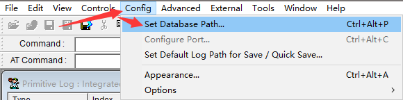
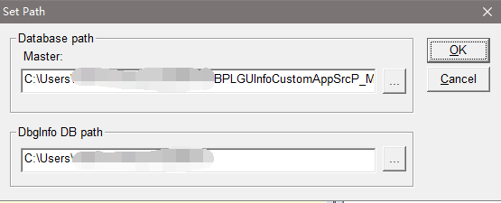
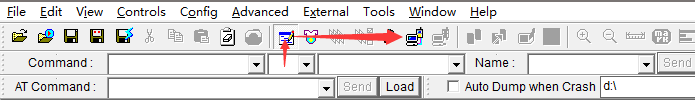
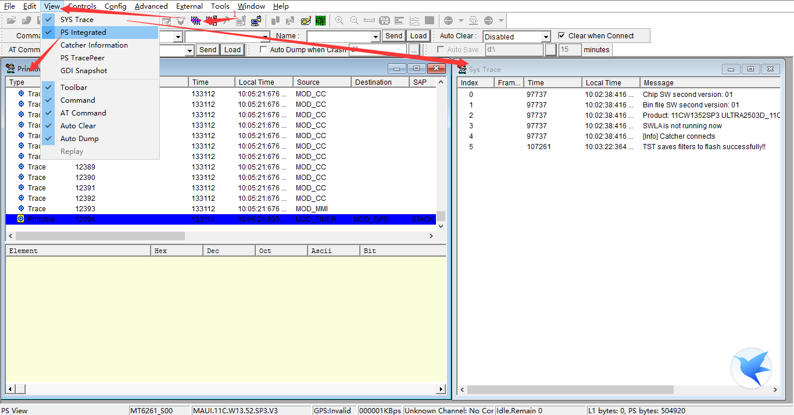

# Catcher USB UART

主要是要注意一下上电顺序，先接Power USB，然后再接Download USB，Log是从Download USB中输出的，开机按键貌似要按挺久的。

## Catcher使用

* 设置数据库的路径，编译自动生成的文件：  
  
* 设置路径选项：  
  
* 打开Log模式，并且连接设备：  
  
* 提供的各种查看信息窗口，到这里基本上和仿真窗口一样的使用方法了：  
  
* 可能有些地方还涉及到[config] --> [Configure Port...]选项卡进行串口选择设置；

