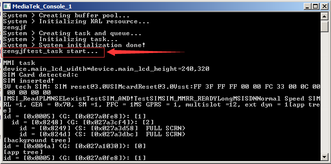

# Task Create

## Command

* `make ULTRA2503D_11C gprs new`;
* `make -debug ULTRA2503D_11C GPRS gen_modis`;

## Create Task

* `config/include/app/app_task_config.h`: 注意添加task的位置，只要在MTK默认的task之后添加，否者编译报错；
  ```C
  [...省略]
  /*********MTK RD add task before this line ****************/
  
  /*************************Task CFG Begin****************/
  /* reserve one task index for marking the last of mtk task; It's for stack sharing */
  /*task_indx_type*/
  task_index(INDX_MTKTASKEND)   
  /*module_type and mod_task_g*/
  task_module_map(INDX_MTKTASKEND, MOD_MTKTASKEND)
  task_name("MTKTSK")
  task_queue_name("MTKTSK Q")
  task_priority(255)
  task_stack_size(0)
  null_task_create_entry(NULL)
  task_stack_internalRAM(KAL_FALSE)
  task_external_queue_size(0)
  task_internal_queue_size(0)
  task_boot_mode(NORMAL_M) 
  ///*************************Task CFG END******************/
  
  /*************************Task CFG Begin****************/
  # if 1
  /*task_indx_type*/
  task_index(INDX_ZENGJF_TEST)
  /*module_type and mod_task_g*/
  task_module_map(INDX_ZENGJF_TEST, MOD_ZENGJF_TEST)
  
  /*task's parameters*/
  task_name("ZENGJFEST")
  task_queue_name("ZENGJFEST Q")
  task_priority(TASK_PRIORITY_ZENGJF_TEST)
  task_stack_size(2048)
  task_create_function(zengjftest_create)
  task_stack_internalRAM(KAL_FALSE)
  task_external_queue_size(10)
  task_internal_queue_size(0)
  task_boot_mode(NORMAL_M)
  #endif
  /*************************Task CFG END******************/
  
  /****config customer task at the end of this file ******/
  /*************************Task CFG Begin****************/
  #if 0
  /* under construction !*/
  /* under construction !*/
  /* under construction !*/
  /* under construction !*/
  /* under construction !*/
  /* under construction !*/
  /* under construction !*/
  /* under construction !*/
  /* under construction !*/
  /* under construction !*/
  /* under construction !*/
  /* under construction !*/
  /* under construction !*/
  /* under construction !*/
  /* under construction !*/
  #endif
  /*************************Task CFG END******************/ 
  ```
* `config/include/hal/stack_msgs.h`: Message Id
  ```C
  [...省略]
  #define MSG_ID_NAME(CK_MSG) MSG_ID_##CK_MSG##_CODE_CHECK_POINT, 
  
  typedef enum {
     MSG_ID_INVALID_TYPE = 0,
     #include "user_msgid_hal.h"
     #include "user_msgid_app.h"
  
     MSG_ID_CUSTOM2_CUSTOM1,
     MSG_ID_CUSTOM1_CUSTOM2,
  #if defined (__FLAVOR_VENDOR_SDK__) || defined(__MAUI_SDK_TEST__)
     MSG_ID_MMI_VS_INTQ_REQ,
     MSG_ID_MMI_VS_SEMAPHONE,
     MSG_ID_MMI_VS_MUTEX,
  #endif  
     MSG_ID_ZENGJFTEST,                                 // custom message id
     MSG_ID_END,
  #if defined(__SMART_PHONE_MODEM__)
     MSG_ID_DUMMY1 = 0x7FFFFFFF,
  #endif 
  } msg_type;
  [...省略]
  ```
* Path: `custom/zengjf`
  * 'zengjf.h'
    ```C
    #ifndef __ZENGJF__
    #define __ZENGJF__
    
    static void zengjftest_task(task_entry_struct * task_entry_ptr);
    kal_bool zengjftest_create(comptask_handler_struct **handle);
    
    #endif // __ZENGJF__
    ```
  * 'zengjf.c'
    ```C
    /***************************************************************************** 
     * Include
     *****************************************************************************/ 
    #include "kal_trace.h"
    #include "stack_msgs.h"         /* enum for message IDs */
    #include "app_ltlcom.h"         /* Task message communiction */
    #include "syscomp_config.h"
    #include "task_config.h"        /* Task creation */
    #include "dcl.h"
    #include "gps_main.h"
    #include "gps_init.h"
    #include "gps_sm.h"
    #include "gps_trc.h"
    #include "stack_ltlcom.h"
    #include "stack_config.h"
    #include "kal_general_types.h"
    #include "kal_public_api.h"
    #include "kal_internal_api.h"
    
    static void zengjftest_task(task_entry_struct * task_entry_ptr)
    {
        kal_uint32 my_index;
        ilm_struct current_ilm;
    
        kal_get_my_task_index(&my_index);
        system_print("zengjftest_task start...\n");
    
        while (1)
        {
            receive_msg_ext_q(task_info_g[task_entry_ptr->task_indx].task_ext_qid,&current_ilm);
            stack_set_active_module_id( my_index, current_ilm.dest_mod_id );
    
            if (current_ilm.msg_id == MSG_ID_ZENGJFTEST)
            {
                system_print("zengjftest_task receive message");
            }   
    
            free_ilm(&current_ilm);
        }
    }
    
    kal_bool zengjftest_create(comptask_handler_struct **handle)
    {
        /*----------------------------------------------------------------*/
        /* Local Variables                                                */
        /*----------------------------------------------------------------*/
    
        static comptask_handler_struct mmi_handler_info = 
        {
            zengjftest_task,   /* task entry function */
            NULL,   /* task initialization function */
            NULL,
            NULL,       /* task reset handler */
            NULL,       /* task termination handler */
        };
    
        /*----------------------------------------------------------------*/
        /* Code Body                                                      */
        /*----------------------------------------------------------------*/
        *handle = &mmi_handler_info;
        return KAL_TRUE;
    }
    ```
* `make/custom/custom.mak`
  ```Makefile
  INC_DIR += tst\local_inc \
  		   custom\zengjf
  
  SRC_LIST += custom\zengjf\zengjf.c
  ```
* `make/config/config.mak`
  ```
  [...省略]
  #  Define include path lists to INC_DIR
  INC_DIR = interface\hwdrv \
            tst\include \
            tst\local_inc\
            hal\system\DP\inc\
            custom\zengjf
  [...省略]
  ```

## Console Output


