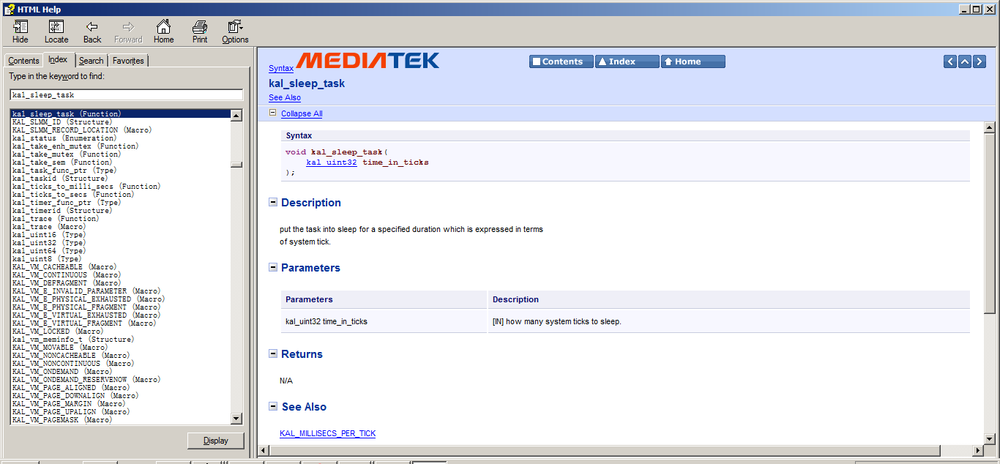

# Task Sleep

## Example Code

```C
static void zengjfsend_task(task_entry_struct * task_entry_ptr)
{
    kal_uint32 my_index;

    kal_get_my_task_index(&my_index);
    kal_sleep_task(20);
    system_print("zengjfsend_task start...\n");
    kal_sleep_task(20);

    while (1)
    {
        ilm_struct *ilm_ptr = allocate_ilm(MOD_ZENGJF_SEND);
        ilm_ptr->src_mod_id = MOD_ZENGJF_SEND;
        ilm_ptr->dest_mod_id = MOD_ZENGJF_TEST;
        ilm_ptr->msg_id = MSG_ID_ZENGJFTEST;
        ilm_ptr->sap_id = 0;
        ilm_ptr->peer_buff_ptr = NULL;
        ilm_ptr->local_para_ptr = NULL;

        msg_send_ext_queue(ilm_ptr);
        kal_sleep_task(200);
    }
}
```

## Doc Ref

Path: `Doc/MAUI_SDK/MAUI_SDK_API/MAUI_SDK_API.chm`  

